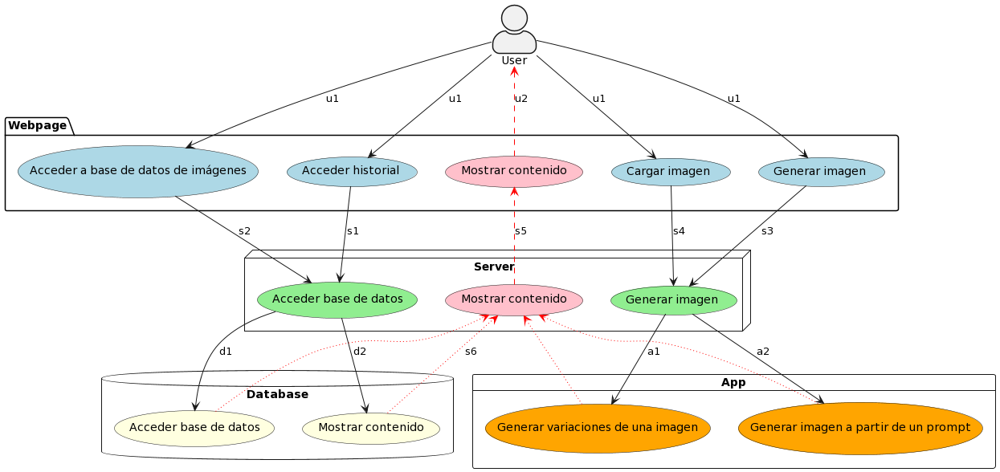

# Diseño Proyecto Midjourney@Home

El diseño cuenta con cuatro módulos:

**Página Web (JavaScript)**

- Entradas especificadas por el usuario
    - Generar Imagen (el usuario debe ingresar texto)
    - Crear variaciones (el usuario debe subir una imagen .png)
    - Acceder a historial
    - Acceder a base de datos de imágenes
    - Imagen seleccionada de la base de datos

- Salidas al usuario
    - Imágenes generadas
    - Categorías de imágenes en la base de datos
    - Imágenes de la base de datos

- Salidas al servidor
    - Texto que será interpretado como prompt / Número de variaciones 
    - Imagen cargada por el usuario
    - Señal para desplegar el historial
    - Señal para desplegar base de datos

**Servidor (Python)**

- Entradas
    - Texto que será interpretado como prompt / Número de variaciones 
    - Imagen cargada por el usuario
    - Señal para desplegar el historial
    - Señal para desplegar base de datos

- Salidas a la APP
    - Texto que será interpretado como prompt / Número de variaciones
    - Imagen cargada por el usuario

- Salidas a la base de datos
    - Señal para desplegar el historial
    - Señal para desplegar base de datos
    - Imagen generada para guardar en el historial

- Salidas a la página web
    - Imágenes (.png)
    - Categorías de la base de datos

**Base de datos (MySQL)**

- Entradas
    - Señal para desplegar el historial
    - Señal para desplegar base de datos
    - Imagen generada para guardar en el historial

- Salidas al servidor
    - Imágenes del historial 
    - Imágenes de la base de datos

**App (Python)**

- Entradas
    - Texto que será interpretado como prompt / Número de variaciones
    - Imagen cargada por el usuario

- Salidas al servidor
    - Imágenes generadas

---

# Diagrama de componentes

**Componentes**

- **Página Web** (Webpage): Aplicación con la que el usuario interactúa. Permite generar imágenes a partir de un prompt, o variaciones de alguna imagen dada. Además cuenta con una base de datos con varias categorías de imágenes de acceso libre. Las imágenes generadas por el usuario se muestran en un historial.
- **Servidor** (Server): Componente con la lógica principal. Accede a la App para generar imágenes, y a la base de datos para acceder tanto al historial de imágenes generadas como a las imágenes existentes.
- **Base de datos** (Database): Base de datos MySQL para almacenar las imágenes.
- **App** : Utiliza la API de Openai para generar imágenes utilizando inteligencia artificial.

**Conectores**

* **u1**: Entradas que el usuario ingresa a la página web.
* **u2**: Salida de la página web. Lo que la página web le muestra al usuario (imágenes).
* **s1, s2, s3 y s4**: Conexiones entre la página web y el servidor. Dependiento de la conexión, se accede a la base de datos (s1 y s2), o se generan imágenes (s3 y s4).
* **s5**: Salida del servidor a la página web. Envía las imágenes para ser mostradas en la página web.
* **s6**: Entradas al servidor provenientes de la App y la Base de datos. Son las imágenes que deben ser enviadas a la página web.
* **d1 y d2**: Conexiones entre el servidor y la base de datos. Dependiendo de la conexión, se accede a la base de datos (d1), o al historial (d2). d1 está asociada a s1, y d2 a s2.
* **a1 y a2**: Conexiones entre el servidor y la App. Dependiendo de la conexión, se genera una imagen a partir de un prompt (a1), o se generan variaciones de una imagen (a2). a1 está asociada a s4, y a2 a s3.

---

# Diagrama de secuencia

---
# Criterios de aceptación

- Se pudo enlazar el historial de imágenes con una base de datos a la que tiene acceso el usuario (cliente)
- El usuario se puede suscribir a una galería de imágenes de dominio público.
- Se puede generar imágenes basadas en una descripción
- Se crean 2 bases de datos: una para que el usuario guarde sus imágenes generadas por los prompts y otra con diferentes categorías de imágenes para que el usuario se pueda suscribir y acceder a ellas.
- El usuario interactúa con los parámetros anteriores mediante una página web

