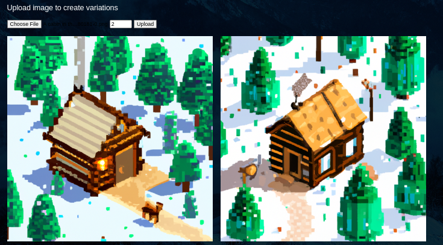

#

## Description

### When you can can't afford Midjourney, you have Midjourney At Home!

- Dive into the world of AI-generated art with our experimental web interface that harnesses the power of the Chat GPT API to create mesmerizing images. This is a **non-commercial**, **work-in-progress project** for a Software Engineering Design Course at the University of Costa Rica (UCR), but it's still packed with creative potential and it's ready for you to explore!

- This is a **proof of concept** project with a self hosted server and SQLite3 database which lives locally on your computer.

## Key Features:

#### 1. 🔮 Text Prompt Section 
Let your ideas flow freely through text prompts, and witness the AI's attempts to interpret and visualize your imagination.


#### 2. 🎨 Image Prompt Section 
Upload images that inspire you, and observe the AI's artistic prowess as it generates captivating visuals based on your inputs.



#### 3.  📜 History Display 
Keep track of your AI-generated creations within the History Display, allowing you to revisit and enjoy the progress of your artistic journey.


#### 4.   📂 Catalog Viewing
Discover a selection of AI-generated images in the Catalog Viewing section. For the time being, the collection is limited.


#### 5.   🖼️  Display of Generated Images 
Behold the AI's ingenuity as it presents the results of its artistic experiments. Create up to 10 images per prompt

## System Requirements

Before proceeding with the setup, ensure your system meets the following requirements:

1. **Operating System:** Linux or Windows.
2. **Python:** Python 3.x installed on your machine.
3. **Python Libraries:** The following Python libraries need to be installed:
   - OpenAI
   - python-dotenv

To install these Python libraries, you can run the following commands in your terminal:

```bash
pip install openai python-dotenv
```
or 

```bash
pip3 install openai python-dotenv
```
## Setting up Midjourney at Home

1. **Clone the Repository:**

   Clone the Midjourney at Home repository to your local machine using the following command:

   ```bash
   git clone https://github.com/alejandroulate/Midjourney-Home.git
   ```
2. **Navigate to the Repository Directory:**

    Change the working directory to the cloned repository directory:

    ```bash
    cd Midjourney-Home
    ```
3. **Make the Bash Script Executable:**

    Make the Midjourney_at_Home.sh Bash script executable by running the following command:
    ```bash
    chmod +x Midjourney_at_Home.sh
    ```

## OpenAI API Key
Please ensure you have an OpenAI premium account with an active API Key. Without the API Key, Midjourney at Home won't have access to the OpenAI API, and image generation will not be possible.